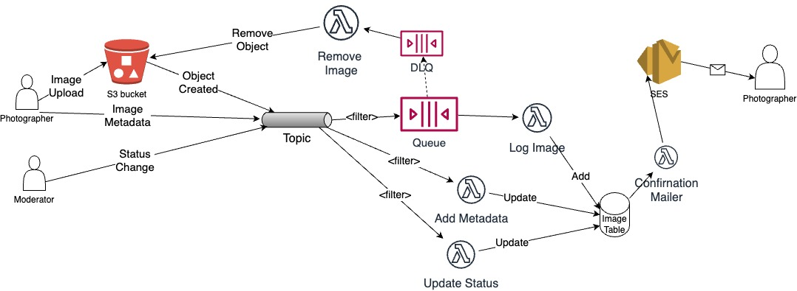

## Distributed Systems - Event-Driven Architecture.

__Name:__ Simon Hickey

__Demo__: https://www.youtube.com/watch?v=-g4Bzy6_cpQ

This repository contains the implementation of a skeleton design for an application that manages a photo gallery, illustrated below. The app uses an event-driven architecture and is deployed on the AWS platform using the CDK framework for infrastructure provisioning.

### Code Status.

__Feature:__
+ Photographer:
  + Log new Images - Completed and Tested.
  + Metadata updating - Completed and Tested.
  + Invalid image removal - Completed and Tested.
  + Status Update Mailer - Attempted.
+ Moderator:
  + Status updating - Completed and Tested.
+ Filtering - Attempted. (Metadata, Image Process Queue)
+ Messaging - Completed and Tested.

### Notes

#### References/Resources

- https://stackoverflow.com/questions/31816906/why-does-dynamodb-require-expressionattributevalue#31817417
- https://docs.aws.amazon.com/amazondynamodb/latest/developerguide/ReservedWords.html
- https://www.dynamodbguide.com/expression-basics/#condition-expressions